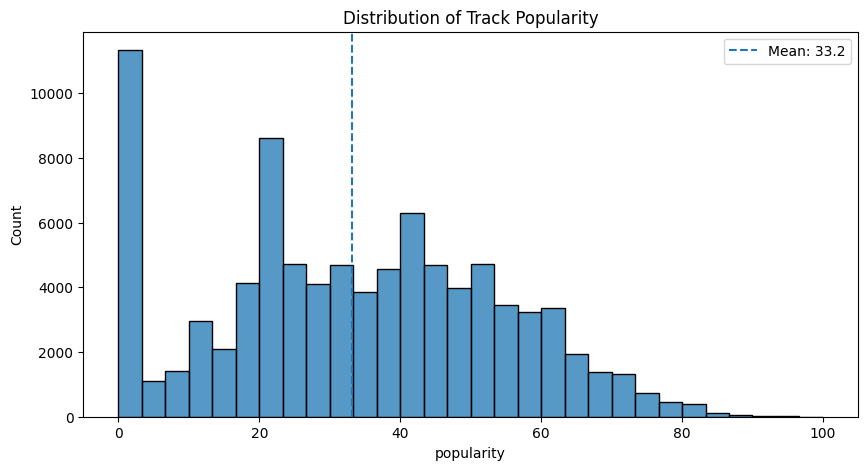
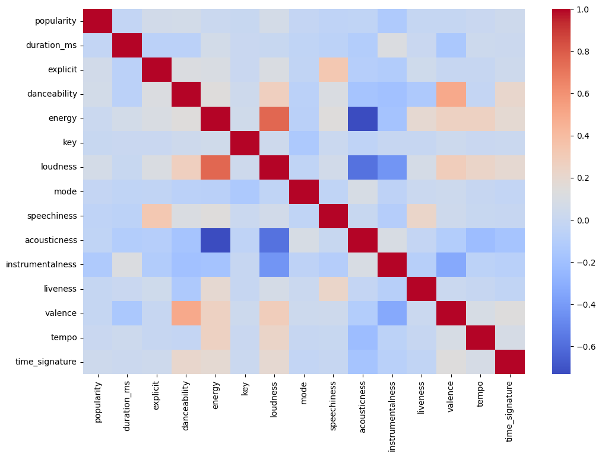
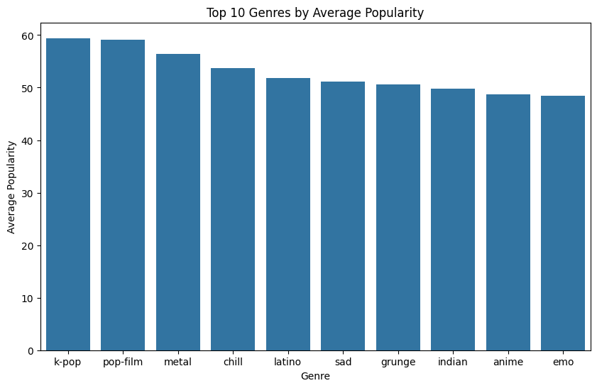

# Spotify Popularity Analysis

## Overview
This project explores the relationship between Spotify track popularity and various audio features using a dataset of over 100,000 tracks. The analysis was performed using Python, Pandas, Matplotlib, and Seaborn to identify patterns in popularity, genre performance, and musical characteristics.

## Dataset
- 114,000 Spotify tracks
- Audio features such as danceability, energy, loudness, and valence
- Popularity scores ranging from 0–100
- Genre information

## Technologies Used
- Python
- Pandas
- NumPy
- Matplotlib
- Seaborn
- Jupyter Notebook

## Key Findings
- The popularity distribution is highly uneven, with a substantial number of tracks receiving a popularity score of 0.
- Most tracks fall within the low-to-mid popularity range, while highly popular tracks are relatively rare.
- Correlation analysis revealed that no individual audio feature strongly predicts popularity.
- Instrumentalness showed the strongest relationship with popularity, exhibiting a weak negative correlation.
- Danceability, loudness, and explicit content showed weak positive relationships with popularity.
- Genre appears to have a greater influence on popularity patterns than individual audio features.

## Popularity Distribution

## Correlation Heatmap

## Top Genres by Average Popularity

